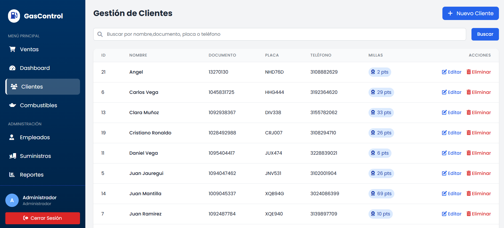
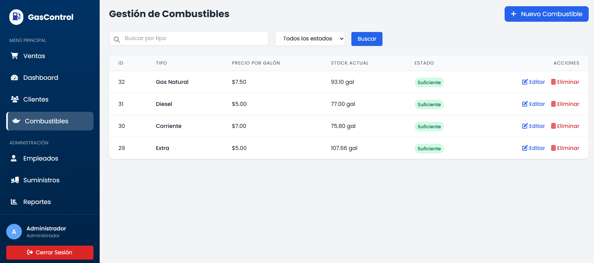
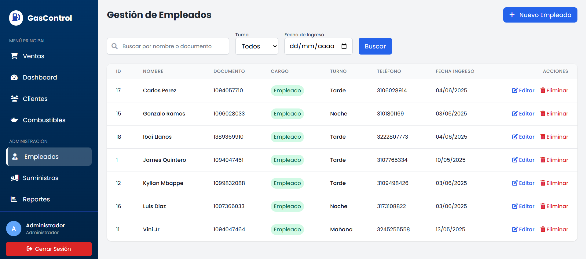
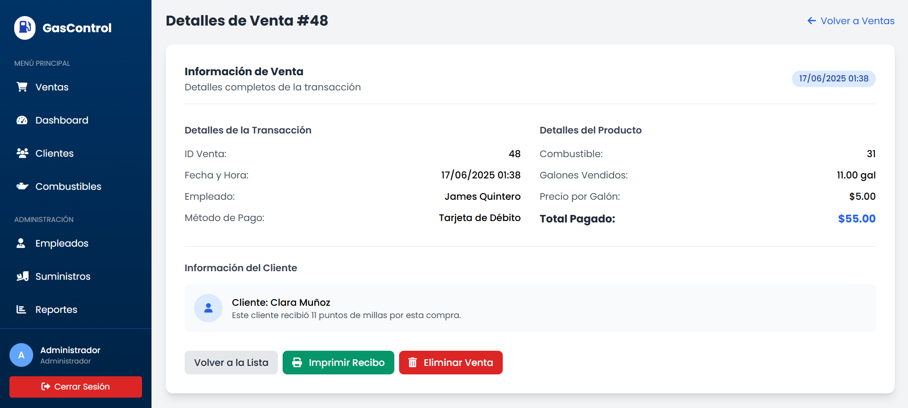
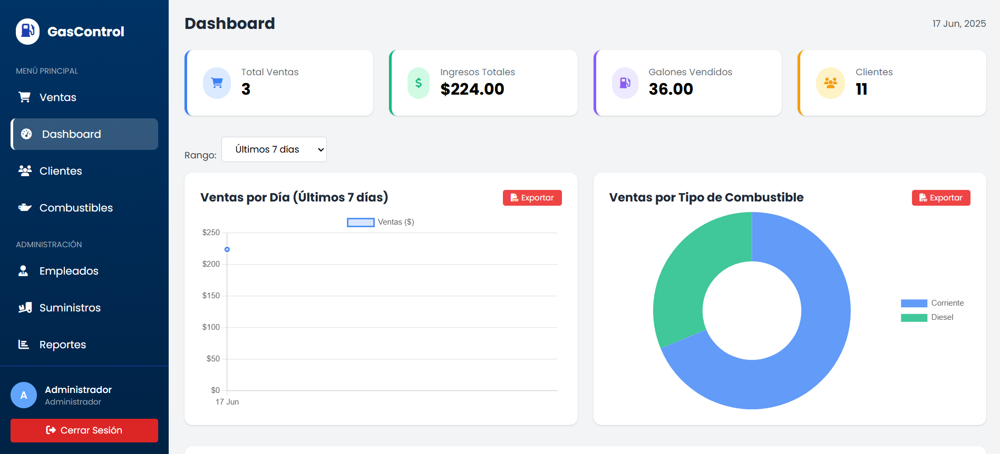
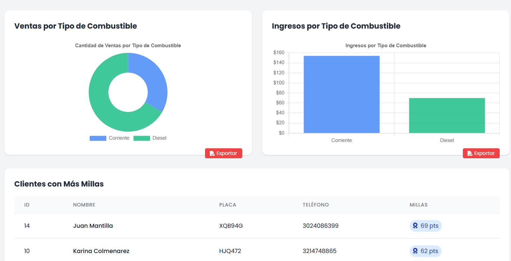
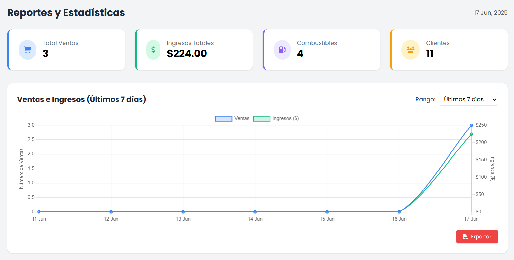

# 🚗 GasControl - Sistema Integral de Gestión para Estaciones de Servicio  
  
**La solución completa para modernizar y optimizar las operaciones de tu gasolinera**  
  
GasControl es un sistema web profesional que digitaliza y automatiza todos los procesos críticos de una estación de servicio, desde la atención al cliente hasta la gestión administrativa, proporcionando control total sobre tu negocio en tiempo real.  
  
## ✨ ¿Por qué elegir GasControl?  
  
### 🎯 **Gestión Inteligente de Clientes**  

- **Sistema de Fidelización**: Programa automático de millas que recompensa a tus clientes frecuentes  
- **Base de Datos Completa**: Registro detallado con información de contacto y vehículos  
- **Historial de Compras**: Seguimiento completo de transacciones por cliente  
  
### ⛽ **Control Total de Inventario**  

- **Monitoreo en Tiempo Real**: Visualización instantánea del stock de todos los combustibles  
- **Alertas Inteligentes**: Sistema de notificaciones por niveles críticos de inventario  
- **Gestión de Suministros**: Registro completo de recepciones y proveedores  
- **Precios Dinámicos**: Actualización flexible de precios por tipo de combustible  
  
### 👥 **Administración de Personal Eficiente** 

- **Gestión de Turnos**: Sistema completo de horarios (mañana, tarde, noche)  
- **Control de Acceso**: Roles diferenciados para administradores y empleados  
- **Registro de Empleados**: Base de datos completa del personal con información de contacto  
  
### 💰 **Procesamiento de Ventas Avanzado**  

- **Múltiples Métodos de Pago**: Efectivo, tarjetas de crédito/débito, transferencias  
- **Cálculo Automático**: Sistema que calcula totales basado en galones y precios actuales  
- **Registro Detallado**: Cada venta queda documentada con fecha, empleado, cliente y combustible  
  
## 📊 **Dashboard y Reportes Profesionales**  

  
### Visualización de Datos en Tiempo Real  

- **Gráficos Interactivos**: Tendencias de ventas diarias con Chart.js  
- **Distribución por Combustible**: Análisis visual de ventas por tipo de producto  
- **Métricas Clave**: Total de ventas, galones vendidos, ingresos generados  
  
### Sistema de Reportes Avanzado 

- **Filtros Flexibles**: Reportes por últimos 7 días, 30 días, mes actual/anterior, o rangos personalizados  
- **Exportación Profesional**: Generación automática de reportes en Excel con estadísticas completas  
- **Exportación PDF**: Gráficos y visualizaciones exportables para presentaciones  
  
## 🔐 **Seguridad y Control de Acceso**  
  
### Roles Diferenciados  
- **Administradores**: Acceso completo a todas las funcionalidades del sistema  
- **Empleados**: Acceso limitado enfocado en procesamiento de ventas  
- **Autenticación Segura**: Sistema de login con validación de credenciales  
  
## 📈 **Características Técnicas Destacadas**  
  
### Interfaz Moderna y Responsiva  
- **Diseño Profesional**: Interfaz limpia desarrollada con Tailwind CSS  
- **Experiencia de Usuario**: Navegación intuitiva y flujos de trabajo optimizados  
- **Iconografía Profesional**: Integración con Font Awesome para una apariencia moderna  
  
### Arquitectura Robusta  
- **Base de Datos Relacional**: Estructura MySQL con integridad referencial  
- **Modelos de Datos**: Sistema orientado a objetos con clases especializadas  
- **Exportación Avanzada**: Integración con PhpSpreadsheet para reportes Excel profesionales  
  
## 🎯 **Casos de Uso Principales**  
  
### Para Propietarios de Gasolineras  
- Monitoreo completo del negocio desde cualquier dispositivo  
- Reportes financieros detallados para toma de decisiones  
- Control de inventario para evitar desabastecimientos  
- Gestión eficiente del personal y turnos  
  
### Para Administradores  
- Supervisión de todas las operaciones diarias  
- Generación de reportes para análisis de rendimiento  
- Gestión completa de clientes y programa de fidelización  
- Control de precios y márgenes de ganancia  
  
### Para Empleados  
- Interfaz simplificada para procesamiento rápido de ventas  
- Sistema intuitivo que minimiza errores en transacciones  
- Acceso controlado según responsabilidades del puesto  
  
## 🚀 **Beneficios Inmediatos**  
  
✅ **Digitalización Completa**: Elimina procesos manuales y reduce errores    
✅ **Eficiencia Operativa**: Optimiza tiempos de atención y procesos internos    
✅ **Fidelización de Clientes**: Sistema automático de recompensas por millas    
✅ **Control Financiero**: Reportes detallados para análisis de rentabilidad    
✅ **Gestión de Inventario**: Previene desabastecimientos y optimiza compras    
✅ **Escalabilidad**: Sistema preparado para crecer con tu negocio    
  
## 💡 **La Solución que tu Gasolinera Necesita**  
  
GasControl no es solo un software, es la herramienta que transformará la gestión de tu estación de servicio, proporcionando el control, la eficiencia y los insights necesarios para hacer crecer tu negocio en el mercado competitivo actual.  
  
**¿Listo para modernizar tu gasolinera?** GasControl te ofrece todo lo que necesitas para llevar tu negocio al siguiente nivel.
